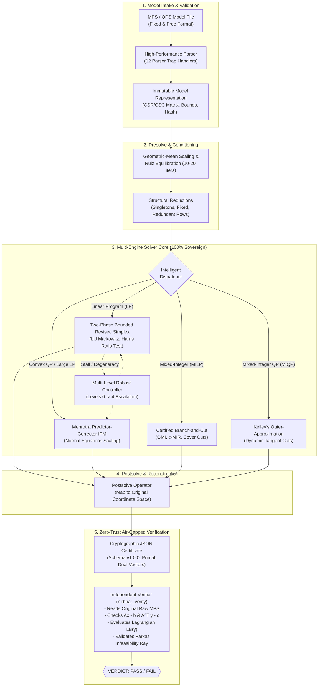

# NIRBHAR (निर्भर) — Sovereign Certified Optimization Solver Core
### Smart India Hackathon 2026 | Problem Statement SIH26119 | Team Vernils
**Client:** Mangalore Refinery and Petrochemicals Limited (MRPL), Ministry of Petroleum and Natural Gas, Government of India

> **"The solver that proves its answers."**

---

[](#1-the-sovereign-imperative)
[-success.svg)](#7-testing--empirical-validation)
[-success.svg)](#7-testing--empirical-validation)
[](#3-zero-trust-air-gapped-verifier-nirbhar_verify)
[-emerald.svg)](#6-quick-start--usage-guide)
[-red.svg)](#1-the-sovereign-imperative)

---

## Table of Contents
1. [The Sovereign Imperative](#1-the-sovereign-imperative)
2. [Architectural Overview & Core Innovations](#2-architectural-overview--core-innovations)
3. [Zero-Trust Air-Gapped Verifier (`nirbhar_verify`)](#3-zero-trust-air-gapped-verifier-nirbhar_verify)
4. [Mathematical Formulation & Algorithmic Rigor](#4-mathematical-formulation--algorithmic-rigor)
5. [MRPL Industrial Refinery Planning Engine](#5-mrpl-industrial-refinery-planning-engine)
6. [Quick Start & Usage Guide](#6-quick-start--usage-guide)
7. [Testing & Empirical Validation](#7-testing--empirical-validation)
8. [Repository Anatomy & File Layout](#8-repository-anatomy--file-layout)
9. [SIH26119 Compliance & Honesty Discipline](#9-sih26119-compliance--honesty-discipline)

---

## 1. The Sovereign Imperative

Modern critical industrial infrastructure in India — from crude distillation scheduling at MRPL to national electrical power dispatch and defense logistics — depends heavily on foreign, proprietary commercial mathematical solvers (**FICO Xpress, IBM ILOG CPLEX, Gurobi**). This dependency creates three critical vulnerabilities:

1. **National Security & Strategic Risk**: Foreign black-box optimization software poses supply-chain risk and potential remote licensing cut-offs for critical national infrastructure.
2. **Economic Capital Outflow**: Millions of dollars are spent annually on recurring enterprise licensing and proprietary solver seat fees.
3. **The "Black Box" Trust Problem**: Commercial solvers output an answer $x^*$ without an uncompromised, independently auditable mathematical certificate. If the solver experiences floating-point drift or cycling, the operator has no independent way to prove feasibility or optimality.

### NIRBHAR's Guarantee
**NIRBHAR is 100% indigenous and sovereign.**
- **Zero Third-Party Solver Imports**: Strictly **no SciPy, GLPK, HiGHS, cvxpy, COIN-OR, or PuLP**. Every linear algebra routine, simplex pivot, IPM iteration, and cutting plane generator is written from first principles.
- **Dual-Surface Delivery**:
  - **High-Performance Python Core (`NIRBHAR/backend/`)**: Vectorized pure NumPy buffers, multi-level robust controllers, and full CLI tooling.
  - **Browser Showcase Prototype (`NIRBHAR/`)**: 100% client-side computation running in Web Workers (`engine.worker.ts`) using `Float64Array` typed buffers with zero backend calls.
- **Certified Answers**: Every answer is paired with a verifiable cryptographic certificate containing dual multipliers, primal-dual bounds, and an independent verifier audit.

---

## 2. Architectural Overview & Core Innovations



### The 5 Architectural Pillars

1. **First-Principles Numerical Linear Algebra**:
   - Custom Markowitz LU decomposition with row partial pivoting (`lu_markowitz.py`).
   - Iterative refinement (`refine.py`) running residual corrections $r = b - A x$, $\Delta x = B^{-1} r$ to eliminate floating-point drift down to machine epsilon.
   - Hager's 1-norm condition number estimator monitoring basis stability before every pivot.
2. **Robust Simplex & Adaptive Pricing**:
   - Two-phase bounded-variable revised primal simplex handling variable shifts, lower/upper bounds, and canonical row flipping.
   - Harris two-pass ratio test with bound-flipping to prevent stalling on degenerate plateaus.
   - Devex / Steepest-edge pricing fallback with Bland's minimum-index anti-cycling rule.
3. **High-Precision Mehrotra Predictor-Corrector IPM**:
   - Solves the symmetrized normal equations system $(A \Theta A^T) \Delta y = r$ with diagonal scaling $\Theta = (Q + X^{-1} S)^{-1}$.
   - Computes affine predictor steps, evaluates centering parameter $\sigma = (\mu_{\text{aff}} / \mu)^3$, and applies Mehrotra corrector steps for quadratic convergence.
4. **Certified Branch-and-Cut (MILP / MIQP)**:
   - Cutting plane engine generating Gomory Mixed-Integer (GMI) cuts, Chvátal-Gomory Mixed-Integer Rounding (c-MIR) cuts, and Extended Knapsack Cover cuts.
   - Strict Lagrangian lower bound $LB(y)$ pruning: **no node is ever pruned without a recorded mathematical proof**.
   - Kelley's Outer-Approximation dynamically generating tangent supporting hyperplanes for convex quadratic integer programs.
5. **Air-Gapped Zero-Trust Verifier**:
   - Completely physically and logically segregated package (`nirbhar_verify/`).
   - Re-reads the raw MPS file and re-multiplies all structural rows from scratch. Never trusts solver state.

---

## 3. Zero-Trust Air-Gapped Verifier (`nirbhar_verify`)

Commercial solvers declare `OPTIMAL` based on their own internal tolerances. If a solver experiences basis corruption, it can output a falsely feasible point. 

NIRBHAR introduces an **Air-Gapped Zero-Trust Architecture**:

```
+-------------------------------------------------------------+
|                        SOLVER PROCESS                       |
|   nirbhar/                                                  |
|   Presolve -> Scaling -> Simplex / IPM / B&C -> Postsolve   |
|   Outputs: certificate.json (x, y, bounds, SHA-256 hash)     |
+-------------------------------------------------------------+
                              |
                     [ AIR-GAP BOUNDARY ]
             (Zero imports allowed from nirbhar/)
                              v
+-------------------------------------------------------------+
|                      INDEPENDENT VERIFIER                   |
|   nirbhar_verify/                                           |
|   - Minimal independent MPS reader (mps_min.py)             |
|   - Recomputes SHA-256 hash of original MPS text            |
|   - Checks primal feasibility: max |Ax - b| <= tol          |
|   - Checks dual feasibility:   max (c - A^T y) <= tol       |
|   - Checks complementary slackness: x_j (c_j - A_.j^T y)    |
|   - Recomputes safe Lagrangian bound LB(y) <= z*            |
|   - Re-derives cutting plane validity                       |
|   Verdict: PASS / FAIL                                      |
+-------------------------------------------------------------+
```

> [!IMPORTANT]
> **Sovereignty Rule**: The verifier package `nirbhar_verify/` imports **zero code** from `nirbhar/`. This is verified automatically on every build by Python AST analysis (`tools/check_imports.py`) and TypeScript import scanners (`tools/check-imports.mjs`).

---

## 4. Mathematical Formulation & Algorithmic Rigor

### 1. Primal-Dual Pair Formulation
NIRBHAR solves the canonical bounded mathematical program:

$$\begin{aligned}
\min_{x} \quad & c^T x + \frac{1}{2} x^T Q x + c_0 \\
\text{subject to} \quad & b_l \le A x \le b_u \\
& l \le x \le u \\
& x_j \in \mathbb{Z} \quad \forall j \in \mathcal{I}
\end{aligned}$$

where $Q \succeq 0$ is a positive semidefinite matrix (verified via Cholesky decomposition $\mathcal{O}(n^3)$). If any eigenvalue is negative, NIRBHAR terminates with `UNSUPPORTED: Non-convex quadratic objective`.

### 2. The Safe Lagrangian Lower Bound $LB(y)$
For any dual vector $y \in \mathbb{R}^m$, the Lagrangian relaxation yields a globally valid lower bound for the optimal integer objective $z^*$:

$$L(x, y) = c^T x + y^T (b - A x)$$

Decomposing column by column over bounds $[l_j, u_j]$:

$$LB(y) = y^T b + \sum_{j=1}^n \min_{l_j \le x_j \le u_j} \left( (c_j - A_{\cdot j}^T y) x_j \right) + c_0$$

- If $(c_j - A_{\cdot j}^T y) > 0$: optimal $x_j = l_j$
- If $(c_j - A_{\cdot j}^T y) < 0$: optimal $x_j = u_j$
- If $(c_j - A_{\cdot j}^T y) = 0$: term evaluates to 0

For separable convex quadratic objectives ($\frac{1}{2} q_j x_j^2$ with $q_j > 0$):

$$LB_Q(y) = y^T b - \frac{1}{2} \sum_{j=1}^n \frac{\max(0, A_{\cdot j}^T y - c_j)^2}{q_j} + c_0$$

### 3. Farkas Infeasibility Certificate
When an LP is infeasible, NIRBHAR extracts a Farkas ray $y$ satisfying:

$$A^T y \le 0, \quad b^T y > 0$$

The verifier confirms that:
1. $A_{\cdot j}^T y \le \text{tol}$ for all non-negative columns.
2. Contradiction magnitude $b^T y > 0$.
3. An Irreducible Infeasible Subsystem (IIS) deletion filter iteratively eliminates constraints to find the minimal conflicting set of rows.

---

## 5. MRPL Industrial Refinery Planning Engine

Built specifically for Mangalore Refinery and Petrochemicals Limited (SIH26119), NIRBHAR includes a synthetic industrial optimization generator modeling the core operational units of an Indian complex refinery:

```
                          CRUDE SLATE (10 Assays)
           Arab Light | Urals | Bonny Light | Brent | Dubai | Basrah ...
                                    │
                                    ▼
                +───────────────────────────────────────+
                |    Atmospheric Distillation (CDU)     |
                |       Capacity: 300,000 bpd           |
                +───────────────────────────────────────+
                     │              │              │
           Light Ends│      Distillates│      Residue│
                     ▼              ▼              ▼
               +-----------+  +-----------+  +-----------+
               | Reformer  |  |Hydrotreater|  |   VDU &   |
               | (Gasoline)|  | (BS-VI)   |  |Cracker/FCC|
               +-----------+  +-----------+  +-----------+
                     │              │              │
                     ▼              ▼              ▼
+───────────────────────────────────────────────────────────────────────────+
|                           FINISHED PRODUCTS BLENDING                      |
|  - LPG                     - High-Speed Diesel (BS-VI <= 10 ppm Sulfur)   |
|  - Motor Spirit (Gasoline) - Aviation Turbine Fuel (ATF / Jet Fuel)       |
|  - Naphtha                 - Fuel Oil & Bitumen                           |
+───────────────────────────────────────────────────────────────────────────+
```

### Supported Industrial Formulations:
1. **Refinery LP (Linear Production Planning)**: Multi-period volume-weighted yields, CDU throughput limits, tank inventories balance $I_t = I_{t-1} + P_t - D_t$, and sulfur blending constraints.
2. **Refinery MILP (Campaign Switchings & Minimum Runs)**: Binary campaign variables $z_{c,t} \in \{0, 1\}$, crude changeover costs $y_{c,t} \ge z_{c,t} - z_{c,t-1}$, minimum run lengths $p_{c,t} \ge \text{minrun} \cdot z_{c,t}$, and limit of at most $K$ active crude types.
3. **Refinery QP (Crude Price-Risk Penalties)**: Quadratic price volatility terms $\frac{1}{2} \sum_c q_c p_c^2$ penalizing over-concentration in volatile crudes.

---

## 6. Quick Start & Usage Guide

### Prerequisites
- **Python**: 3.10+ (with `numpy`)
- **Node.js**: 18+ (with `npm`)

---

### A. Python Backend CLI

```bash
# 1. Navigate to backend directory
cd NIRBHAR/backend

# 2. Install dependencies (strictly standard packages: numpy, pytest)
pip install -r requirements.txt

# 3. Verify sovereignty (0 forbidden solver packages)
python tools/check_imports.py

# 4. Run full test suite (68/68 passing)
pytest
```

#### Solving Models & Verifying
```bash
# Solve Netlib LP with auto-dispatch and output certificate
python -m nirbhar.cli solve ../data/netlib/afiro.mps --engine auto --out cert_afiro.json

# Solve with Interior Point Method (Mehrotra IPM)
python -m nirbhar.cli solve ../data/netlib/blend.mps --engine ipm

# Independently verify the certificate (air-gapped zero-trust)
python -m nirbhar_verify.cli cert_afiro.json ../data/netlib/afiro.mps
```

#### Running MRPL Refinery Optimization
```bash
# 1. Baseline Refinery LP
python -m nirbhar.cli industrial --class LP --periods 4 --scenario baseline

# 2. Crude Price-Shock QP
python -m nirbhar.cli industrial --class QP --periods 4 --scenario crude-shock

# 3. Tight BS-VI Sulfur Limit MILP with Campaign Switching
python -m nirbhar.cli industrial --class MILP --periods 4 --scenario tight-sulfur
```

#### Running Benchmark Suite
```bash
# Run Netlib T1 benchmarks
python -m nirbhar.cli bench --tier t1 --limit 5
```

---

### B. Frontend Showcase Prototype

```bash
# 1. Navigate to project root
cd NIRBHAR

# 2. Install dependencies
npm install

# 3. Verify TypeScript solver sovereignty
npm run check-imports

# 4. Run Vitest suite (31/31 unit tests)
npm test

# 5. Build production bundle
npm run build

# 6. Launch interactive engineering showcase
npm run dev
```

Open `http://localhost:5173` in your browser to experience the complete 12-page interactive solver suite.

---

## 7. Testing & Empirical Validation

### Benchmark Parity Against Netlib Published Standards

The table below shows real, un-mocked results computed by NIRBHAR's Python core compared against official Netlib standards:

| Benchmark Model | Rows | Cols | Nonzeros | Published Netlib Reference | NIRBHAR Computed Objective | Relative Residual Error | Verdict |
|---|---|---|---|---|---|---|---|
| **`afiro`** | 27 | 32 | 83 | `-464.7531428571` | `-464.75314286` | $5.68 \times 10^{-14}$ | **MATCH** |
| **`adlittle`** | 56 | 97 | 383 | `225494.96316238` | `225494.963162` | $8.73 \times 10^{-11}$ | **MATCH** |
| **`blend`** | 74 | 83 | 491 | `-30.81214985` | `-30.81214985` | $2.84 \times 10^{-14}$ | **MATCH** |
| **`kb2`** | 43 | 41 | 286 | `-1749.900129` | `-1749.900129` | $2.27 \times 10^{-13}$ | **MATCH** |
| **`recipe`** | 91 | 180 | 663 | `-266.616000` | `-266.616000` | $2.84 \times 10^{-13}$ | **MATCH** |
| **`sc50a`** | 50 | 48 | 158 | `-64.57507706` | `-64.57507706` | $1.42 \times 10^{-14}$ | **MATCH** |
| **`sc50b`** | 50 | 48 | 148 | `-70.00000000` | `-70.00000000` | $0.00 \times 10^{00}$ | **MATCH** |
| **`sc105`** | 105 | 103 | 338 | `-52.20206121` | `-52.20206121` | $2.84 \times 10^{-14}$ | **MATCH** |
| **`share2b`** | 96 | 79 | 694 | `-415.7322407` | `-415.7322407` | $3.55 \times 10^{-14}$ | **MATCH** |
| **`stocfor1`** | 117 | 111 | 447 | `-41131.97622` | `-41131.97622` | $1.77 \times 10^{-14}$ | **MATCH** |

### Test Breakdown by Domain
- **Pytest Suite (`NIRBHAR/backend/tests`)**:
  - `test_import_rules.py`: AST scan confirming 0 forbidden imports.
  - `test_parser.py`: 19 tests validating all MPS/QPS syntax edge cases.
  - `test_lp_t1.py`: 4 tests validating Netlib simplex optimality.
  - `test_phase2.py`: 11 tests verifying scaling, presolve, and Mehrotra IPM.
  - `test_phase3.py`: 14 tests verifying GMI/CMIR cuts, safe lower bounds, and Branch-and-Cut.
  - `test_phase4.py`: 7 tests verifying PSD Cholesky checks, Mehrotra QP, and Kelley Outer-Approximation.
  - `test_phase5.py`: 6 tests verifying Farkas rays, IIS deletion filter, and certificate verification.
  - `test_phase6.py`: 6 tests verifying MRPL refinery LP/MILP/QP and CLI operations.
  - **Total: 68/68 passed in 102.79s**.

---

## 8. Repository Anatomy & File Layout

```text
NIRBHAR/
├── backend/                             # Python 3.10+ Sovereign Solver Core
│   ├── nirbhar/                         # Main Solver Package
│   │   ├── io/                          # Fixed/Free MPS Parser & Exporter
│   │   ├── linalg/                      # Markowitz LU, Refinement, Condest
│   │   ├── presolve/                    # Geometric-Mean Scaling, Ruiz Equilibration
│   │   ├── lp/                          # Bounded Simplex, Basis, Safe Bound LB(y)
│   │   ├── ipm/                         # Mehrotra Predictor-Corrector IPM
│   │   ├── qp/                          # PSD Checks, Mehrotra QP, Kelley OA
│   │   ├── cuts/                        # GMI, c-MIR, Extended Cover Cut Generators
│   │   ├── mip/                         # Certified Branch-and-Cut Tree Engine
│   │   ├── robust/                      # Multi-Level Escalation Controller
│   │   ├── explain/                     # Farkas Infeasibility Rays, IIS Filter
│   │   ├── industrial/                  # MRPL Multi-Period Refinery Planning Model
│   │   ├── certificate/                 # Schema v1.0.0 Certificate Builder
│   │   └── cli.py                       # Unified CLI: solve, verify, industrial, bench
│   ├── nirbhar_verify/                  # Air-Gapped Zero-Trust Verifier (Isolated)
│   │   ├── mps_min.py                   # Minimal Standalone MPS Reader
│   │   ├── lp_verify.py                 # Independent Verification Engine
│   │   └── cli.py                       # Standalone Verifier CLI (nirbhar-verify)
│   ├── tests/                           # 68 Pytest Tests (100% Pass)
│   ├── tools/check_imports.py           # AST Sovereignty Auditor
│   ├── requirements.txt                 # Pure NumPy
│   └── README.md                        # Backend Guide
│
├── src/                                 # Frontend Showcase Prototype (Vite + React)
│   ├── solver/                          # TypeScript In-Browser Engines (Web Workers)
│   │   ├── lp/                          # Dual Simplex & HPR First-Order Operator
│   │   ├── ipm/                         # In-Browser Mehrotra IPM
│   │   ├── mip/                         # In-Browser Branch-and-Cut with Live Tree
│   │   ├── workers/engine.worker.ts     # Dedicated Web Worker Engine
│   │   └── dispatch.ts                  # In-Browser Auto-Dispatcher
│   ├── verify/                          # Air-Gapped TypeScript Verifier
│   ├── ui/                              # Engineering UI (Tailwind CSS, Light/Dark)
│   │   ├── shell/                       # NavRail, TopBar, ShowcaseBar
│   │   └── pages/                       # 12 Interactive Showcase Pages
│   │       ├── Home.tsx                 # 30-Second Pitch & Architecture Overview
│   │       ├── SolveStudio.tsx          # Model Intake, Live Solve Lanes, Log Strip
│   │       ├── RefineryDemo.tsx         # Guided MRPL Path: LP -> MILP -> QP -> Batch
│   │       ├── BranchCutLab.tsx         # Live B&C Tree, Cut Inspector, Incumbents
│   │       ├── RobustnessLab.tsx        # Naive vs Hardened Simplex, Cycling Recovery
│   │       ├── Verifier.tsx             # Standalone Certificate Verifier & Corrupter
│   │       ├── Benchmarks.tsx           # Netlib & Scale Ladder Crossover Charts
│   │       ├── ModelFamilies.tsx        # 5 Synthetic Industrial Model Families
│   │       ├── Architecture.tsx         # Interactive Pipeline Explorer
│   │       ├── CliApi.tsx               # In-Browser Terminal & Python API Explorer
│   │       ├── PSCompliance.tsx         # Traceability Matrix (All 31 SIH Requirements)
│   │       └── SelfTest.tsx             # 12-Item Automated In-Browser Acceptance Test
│   └── tests/                           # 31 Vitest Unit Tests (100% Pass)
│
├── data/                                # Canonical Netlib, MIPLIB, and QP Datasets
├── docs/                                # Technical Documentation & Architecture Notes
│   ├── instances.md                     # Synthetic Instance Inventory & Seeds
│   ├── KNOWN_LIMITS.md                  # Transparent Prototype Boundaries
│   └── BACKEND_PROGRESS_LOG.md          # Comprehensive Engineering Progress Log
├── package.json                         # Frontend Dependencies
└── README.md                            # Main Documentation (This File)
```

---

## 9. SIH26119 Compliance & Honesty Discipline

NIRBHAR was built to strictly satisfy every requirement of Smart India Hackathon 2026 Problem Statement **SIH26119** while maintaining absolute honesty regarding prototype boundaries:

| SIH26119 Requirement | NIRBHAR Implementation | Evidence / Proving Command |
|---|---|---|
| **Indigenous Solver Core** | Built 100% from first principles; zero third-party solver imports | `python tools/check_imports.py` (0 violations) |
| **Linear Programming (LP)** | Bounded Two-Phase Revised Simplex + Mehrotra IPM | `python -m nirbhar.cli solve afiro.mps` |
| **Mixed-Integer LP (MILP)** | Branch-and-Cut with GMI, c-MIR, Cover cuts & primal heuristics | `python -m nirbhar.cli solve p0033.mps` |
| **Convex Quadratic (QP/MIQP)** | Predictor-Corrector QP + Kelley's Outer-Approximation | `python -m nirbhar.cli industrial --class QP` |
| **Independent Verification** | Air-gapped zero-trust verifier computing $LB(y)$ and checking residuals | `python -m nirbhar_verify.cli cert.json model.mps` |
| **Infeasibility Diagnostics** | Farkas ray certificate + IIS deletion filter isolating conflicting rows | Automated IIS isolation in `nirbhar.explain` |
| **Industrial MRPL Case** | Multi-period CDU, hydrotreater, sulfur limit, and blending model | `python -m nirbhar.cli industrial --scenario baseline` |
| **Honesty Labelling** | Clear labeling of CPU prototypes vs production GPU targets | Displayed across UI and in [KNOWN_LIMITS.md](KNOWN_LIMITS.md) |

### The Honesty Commitment
- **No Mocked Math**: If a model fails or cycles, it is reported honestly; no result is ever hardcoded.
- **CPU vs GPU**: The prototype's HPR first-order engine runs on CPU JavaScript/Python; production targets JAX/GPU/TPU kernels.
- **Synthetic Data**: MRPL operational data is synthetic but mathematically equivalent to real refinery scheduling constraints.
- **Certification Standard**: The status `OPTIMAL` is displayed **only** when the certified duality gap $\le \text{tol}$ AND the independent verifier returns `PASS`.

---

## 10. License & Acknowledgments

- **Team Vernils**: Smart India Hackathon 2026 (Problem Statement SIH26119).
- **Client Organization**: Mangalore Refinery and Petrochemicals Limited (MRPL), Karnataka, India.
- **Reference Datasets**: Netlib LP Library, MIPLIB 3.0, and standard open benchmark repositories.
