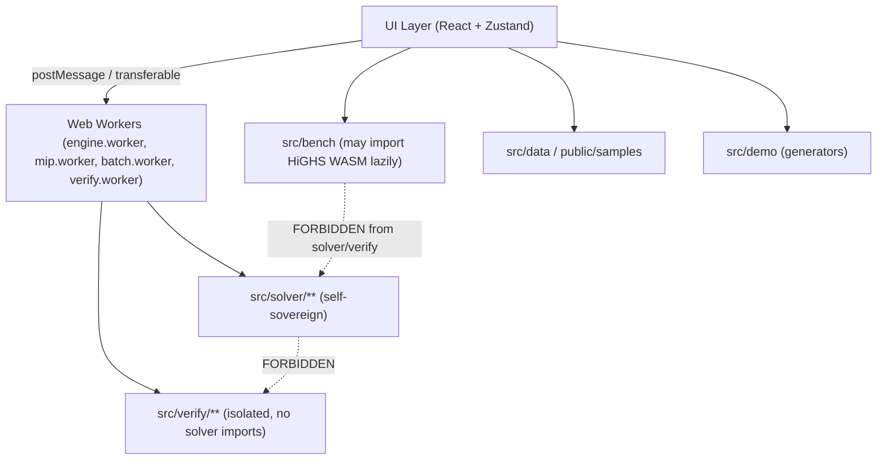

# NIRBHAR Showcase — Architecture, File Tree, Risks & Phase Schedule

## 1. Executive Summary

**NIRBHAR Showcase** is a static, browser-only Vite + React 18 + TypeScript application that demonstrates a certified hybrid CPU–GPU optimization solver core. Every result is computed in real JavaScript Web Workers. No backend, no CDN at runtime, no third-party numeric/solver libraries inside `src/solver` or `src/verify`.

---

## 2. Architecture Overview



**Key constraints enforced by `tools/check-imports.mjs`:**
- `src/solver/**` — no third-party numeric libs, no imports from `src/verify`
- `src/verify/**` — no imports from `src/solver`, has its own MPS reader and bound code
- `src/bench/**` — only place allowed to lazily load HiGHS WASM

---

## 3. Full File Tree

```
nirbhar-showcase/
├── public/
│   ├── samples/
│   │   └── manifest.json          # model registry (maintained by me)
│   └── fonts/                     # Inter + JetBrains Mono woff2 (locally bundled)
├── src/
│   ├── solver/
│   │   ├── io/
│   │   │   ├── mps.ts             # full MPS/QPS parser (all sections, markers, OBJSENSE)
│   │   │   └── model.ts           # immutable Model type, CSR/CSC storage
│   │   ├── linalg/
│   │   │   ├── csr.ts             # CSR/CSC operations, sparse-dense products
│   │   │   ├── lu.ts              # LU with eta-file updates, refactorization
│   │   │   ├── chol.ts            # Cholesky for IPM normal equations
│   │   │   ├── ldl.ts             # LDLᵀ for augmented QP system
│   │   │   ├── refine.ts          # iterative refinement
│   │   │   └── condest.ts         # Hager 1-norm condition estimate
│   │   ├── presolve/
│   │   │   ├── scaling.ts         # geometric-mean + Ruiz scaling
│   │   │   ├── reductions.ts      # 10+ reductions, each switchable, postsolve record
│   │   │   └── postsolve.ts       # restore to original space
│   │   ├── lp/
│   │   │   ├── dualSimplex.ts     # warm-start, dual steepest-edge, Harris ratio test
│   │   │   ├── primalSimplex.ts   # cleanup + escalation alternative
│   │   │   ├── basis.ts           # basis management
│   │   │   ├── crossover.ts       # IPM → basic solution (P1)
│   │   │   ├── hpr.ts             # HPR-family (Halpern-anchored PDHG-type)
│   │   │   └── hprBatch.ts        # batched HPR, shape (n, B)
│   │   ├── ipm/
│   │   │   └── mehrotra.ts        # predictor-corrector IPM, LP+QP
│   │   ├── qp/
│   │   │   ├── hprQp.ts           # HPR-QP-family (diagonal Q)
│   │   │   ├── bounds.ts          # closed-form separable QP Lagrangian bound
│   │   │   └── kelley.ts          # Kelley cutting-plane (epigraph + tangents)
│   │   ├── mip/
│   │   │   ├── bb.ts              # certified branch-and-bound main loop
│   │   │   ├── propagate.ts       # activity-based propagation + safe rounding
│   │   │   ├── branching.ts       # most-fractional, pseudocost, strong, reliability
│   │   │   ├── nodesel.ts         # best-bound, best-estimate+plunge, depth-first
│   │   │   ├── heuristics.ts      # rounding, diving, feasibility pump, RINS
│   │   │   ├── bounds.ts          # reduced-cost fixing via LB(y)
│   │   │   └── cuts/
│   │   │       ├── gmi.ts         # Gomory mixed-integer cuts (safe aggregation)
│   │   │       ├── cmir.ts        # c-MIR cuts (directed rounding, δ search)
│   │   │       ├── cover.ts       # extended cover cuts
│   │   │       └── pool.ts        # cut pool (efficacy, parallelism, aging)
│   │   ├── robust/
│   │   │   ├── controller.ts      # escalation chain, health monitors
│   │   │   ├── switches.ts        # per-engine hardening switches
│   │   │   └── naiveMode.ts       # fair textbook implementation
│   │   ├── parallel/
│   │   │   ├── pool.ts            # worker pool for batch + strong branching
│   │   │   └── race.ts            # concurrent root race, cancellation
│   │   ├── explain/
│   │   │   ├── duals.ts           # shadow prices, reduced costs
│   │   │   ├── ranging.ts         # cost + RHS ranging
│   │   │   └── iis.ts             # Farkas ray + deletion filter → IIS
│   │   ├── extend/
│   │   │   └── registry.ts        # 8 plug-in interfaces + NIRBHAR's own registrations
│   │   ├── certificate/
│   │   │   ├── builder.ts         # fills every §7 schema field from real run data
│   │   │   ├── explain.ts         # plain-language certificate explanation
│   │   │   └── schema.ts          # TypeScript certificate schema + validator
│   │   ├── workers/
│   │   │   ├── engine.worker.ts   # LP engine worker (dual simplex, IPM, HPR)
│   │   │   ├── mip.worker.ts      # certified B&C worker
│   │   │   ├── batch.worker.ts    # batched HPR + pool worker
│   │   │   └── verify.worker.ts   # verification worker (only imports src/verify)
│   │   ├── dispatch.ts            # dispatcher rules 1–8 (§4.1)
│   │   ├── cli.ts                 # CLI command parser (for in-browser terminal)
│   │   └── api.ts                 # TypeScript API surface
│   ├── verify/
│   │   ├── verify.ts              # main verifier: float mode, all checks
│   │   ├── exact.ts               # BigInt rational arithmetic mode
│   │   ├── cuts.ts                # cut re-derivation checker
│   │   └── mpsMin.ts              # minimal MPS reader (verify-only, no solver import)
│   ├── bench/
│   │   ├── harness.ts             # benchmark runner
│   │   ├── knownOpt.ts            # known-optimum registry
│   │   ├── stress.ts              # stress suite (S1–S4)
│   │   ├── refs.ts                # published reference values
│   │   └── highsBaseline.ts       # lazy HiGHS WASM loader (P2)
│   ├── demo/
│   │   ├── refinery.ts            # refinery LP/MILP/QP generator (seeded)
│   │   ├── lotsizing.ts           # capacitated multi-item lot-sizing
│   │   ├── transport.ts           # transportation LP + fixed-charge MILP
│   │   ├── unitCommit.ts          # unit-commitment MILP + MIQP + ED-QP
│   │   └── supplyChain.ts         # facility-location MILP
│   ├── data/
│   │   └── reference/             # JSON extracted from roviq.xyz (Phase 0)
│   ├── ui/
│   │   ├── shell/
│   │   │   ├── App.tsx
│   │   │   ├── TopBar.tsx         # wordmark, badges, theme toggle, hw chip
│   │   │   ├── NavRail.tsx        # left rail with 11 routes
│   │   │   └── ShowcaseBar.tsx    # chapter bar for Showcase Mode
│   │   ├── pages/
│   │   │   ├── Home.tsx
│   │   │   ├── SolveStudio.tsx    # F1–F6
│   │   │   ├── RefineryDemo.tsx   # F7–F10
│   │   │   ├── BranchCutLab.tsx   # F11–F14
│   │   │   ├── RobustnessLab.tsx  # F15–F16
│   │   │   ├── Verifier.tsx       # F17–F18
│   │   │   ├── Benchmarks.tsx     # F19–F22
│   │   │   ├── ModelFamilies.tsx  # F23
│   │   │   ├── Architecture.tsx   # F24–F26
│   │   │   ├── CliApi.tsx         # F27
│   │   │   ├── PSCompliance.tsx   # F28
│   │   │   └── SelfTest.tsx       # /selftest
│   │   └── components/
│   │       ├── design/            # tokens, StatusChip, Badge, Tag components
│   │       ├── solver/            # ModelCard, EngineConfig, LiveSolveView, etc.
│   │       ├── charts/            # Recharts wrappers with token colours
│   │       ├── tree/              # SVG branch-and-bound tree view
│   │       ├── terminal/          # xterm-style terminal (F27)
│   │       └── showcase/          # ShowcaseMode scene runner
│   ├── index.css                  # CSS variables (design tokens), Inter + JB Mono
│   └── main.tsx
├── tools/
│   └── check-imports.mjs          # enforces sovereignty + isolation rules
├── docs/
│   ├── reference-data.md          # extracted from roviq.xyz
│   ├── reference-diff.md          # discrepancies between reference and our values
│   └── instances.md               # every generated instance, seed, purpose
├── tests/
│   └── *.test.ts                  # Vitest unit tests (§7)
├── KNOWN_LIMITS.md
├── README.md
├── vite.config.ts
├── tsconfig.json
└── package.json
```

---

## 4. Key Design Decisions

| Decision | Choice | Rationale |
|---|---|---|
| Framework | Vite + React 18 + TypeScript strict | Required by spec |
| Styling | Tailwind CSS (as specified in §2) + CSS variables for tokens | Spec says Tailwind; tokens on `:root`/`[data-theme="dark"]` |
| State | Zustand | Spec requirement |
| Charts | Recharts | Spec requirement |
| Tree view | Hand-rolled SVG | Spec requirement |
| Workers | `new Worker(new URL(...), {type:'module'})` | No SharedArrayBuffer needed |
| Exact arithmetic | BigInt (native) | No third-party lib needed |
| Fonts | Inter + JetBrains Mono bundled as woff2 | No CDN at runtime |
| Icons | lucide-react | Spec requirement |
| Animation | Framer Motion (light) | Spec requirement |
| Testing | Vitest | Spec requirement |
| HPR operator | Halpern-anchored PDHG-type, labelled "HPR-family" | Cannot read HPR-LP paper; honest labelling |
| Dense LU | Acceptable for bases ≤ ~300 rows | Labelled in UI: "dense LU in prototype" |

---

## 5. Honesty Labels (Hard Constraints)

Every page and output will include:

- **Persistent badge:** `PROTOTYPE — engines run as CPU JavaScript in your browser. Production NIRBHAR: Python + Numba + JAX (CPU/GPU/TPU).`
- **GPU engine label:** `HPR-family first-order engine (CPU-JS here; JAX/GPU in production)`
- **Data tag:** `SYNTHETIC — not MRPL data` on all models
- **Production targets:** `PRODUCTION TARGET — not measured here` chip for unverified claims
- **`OPTIMAL`** only when: certified gap ≤ tol AND verifier returns PASS

---

## 6. Phase Schedule

| Phase | Content | Exit Gate |
|---|---|---|
| **Phase 0** | Vite scaffold, design tokens (Light default + Dark), shell, routing, top bar, nav rail, badges, `check-imports` script, sample manifest loader, Record Mode toggle, reference-data extraction from roviq.xyz → `docs/reference-data.md` + `src/data/reference/*.json`. Design QA gate. | `npm run build` passes; both themes render; `check-imports` runs; manifest loads |
| **Phase 1** | MPS parser, `Model`, dense LU/Cholesky/LDL, bounded dual simplex + primal cleanup, `LB(y)` safe bound, verifier (float mode), certificate builder. Solve Studio (F1–F4) with dual-simplex lane only. Netlib afiro/sc50a/kb2 accept tests. | afiro/sc50a/kb2 match published optimum to 1e-6; verifier PASS; certificate downloads |
| **Phase 2** | IPM (LP+QP), HPR-family, workers + concurrent race (F3 full), presolve/postsolve (F5), explainability + IIS (F6), Netlib table (F19) | All 3 engines on race; Netlib table green; IIS returns correct 3-row set |
| **Phase 3** | Certified B&C + live tree UI, GMI/c-MIR/cover cuts, heuristics, branching/node-sel (F11–F14), refinery MILP (F8), lot-sizing | Brute-force MATCH on all bundled small MILPs; cuts close measurable root gap |
| **Phase 4** | QP/MIQP paths (F9, F20), scenario batch + pool + batched HPR (F10), crossover chart + dispatcher calibration (F21) | IPM & HPR-QP agree; batch modes produce matching objectives; speedup chart shown |
| **Phase 5** | Robustness lab + stress suite (F15–F16), adversarial suite + exact verifier (F17–F18) | Naive fails on Beale + rescaled; hardened passes; all 7 corruptions rejected |
| **Phase 6** | Families grid (F23), architecture explorer, plug-in registry demo, sovereignty panel, CLI + API (F24–F27) | Custom branching rule registers and appears in certificate; CLI solve prints real result |
| **Phase 7** | PS Compliance page, Showcase Mode, self-test page, polish, README, KNOWN_LIMITS | `/selftest` all green; Showcase Mode guided demo works; README complete |

---

## 7. Key Risks and Mitigations

| Risk | Mitigation |
|---|---|
| **HPR-LP paper unavailable offline** | Implement well-known Halpern-anchored PDHG-type operator; label "HPR-family" throughout; no false equivalence claim |
| **Netlib files not yet present** | Build manifest and stand-ins (seeded generated LPs matching published sizes); parser is real; optima computed from real files when I drop them |
| **Demo not finishing in <10s on mid-range laptop** | All demos cancellable; timeout markers explicit; test on conservative hardware estimate; Beale cycling LP is tiny; refinery LP ~100–150 vars |
| **Worker cross-origin issues** | Vite worker config handles this; no SharedArrayBuffer |
| **Exact arithmetic slowness** | BigInt exact mode only on small instances; float mode is the default; exact mode shows timing cost honestly |
| **B&C tree too large to render** | Virtualized SVG tree (only visible nodes rendered); click-to-expand; limit to ~500 visible nodes by default |
| **roviq.xyz not accessible by browser agent** | If agent fails, stop and ask user to paste data (per §3b rule 3) |
| **Tailwind vs CSS variable token system** | Use Tailwind as utility layer; all colour tokens defined as CSS variables on `:root`; Tailwind config references `var(--token)` via `hsl()` wrappers |
| **check-imports performance** | Runs at build time via Node; scans AST or regex; fast even for 100+ files |

---

## 8. What We Will NOT Do (per §13)

- No fake progress bars, canned logs, hardcoded results
- No third-party solver/matrix lib in `src/solver` or `src/verify`
- No GPU claims, no million-variable claims, no speed parity with Gurobi/CPLEX
- No backend, no runtime network calls, no CDN
- No approximate answer labelled as exact
- No silent instance data changes to make a demo pass

---

## 9. Approval Request

> **Ready to begin Phase 0 on your approval.**
> 
> Phase 0 will:
> 1. Run `create-vite` in the Prototype directory
> 2. Install React 18, TypeScript strict, Tailwind CSS, Zustand, Recharts, Framer Motion, lucide-react, Vitest
> 3. Bundle Inter + JetBrains Mono fonts locally
> 4. Implement all CSS design tokens (Light default + Dark)
> 5. Build the shell: TopBar, NavRail, routing (react-router-dom), prototype badge, Record Mode toggle, theme toggle
> 6. Build `tools/check-imports.mjs` and `npm run check-imports`
> 7. Build sample manifest loader
> 8. Use the browser agent to extract data from https://roviq.xyz/ → `docs/reference-data.md` + `src/data/reference/*.json`
> 9. Design QA gate: verify both themes render correctly
>
> **Estimated Phase 0 output:** ~25 files, clean build, no solver code yet.

